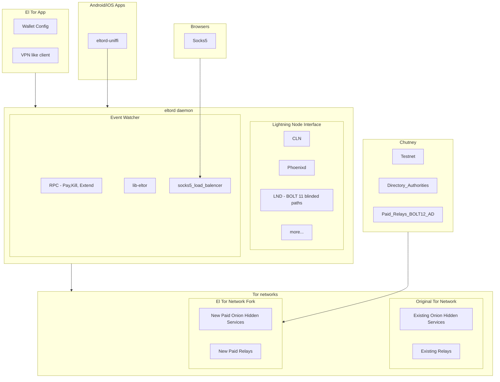

El Tor
======
El Tor is a high-bandwidth Tor network fork, incentivized by the Bitcoin Lightning Network. Users can host El Tor relays and earn sats for sharing their bandwidth. 
The urgency for such a network has never been greater, especially in light of escalating privacy threats globally—from Brazil's VPN
prohibition to the legal challenges faced by Telegram's Pavel Durov.

El Tor aims to transcend the existing boundaries of the Tor network and to scale beyond its current limitation. 
The project was inspired by the need for a private internet and the cypherpunk vision. BOLT 12 offers (with blinded paths) 
are used for privately paying relays. El Tor not only helps with censorship resistance but also enables efficient 
Lightning and Bitcoin node communication. A higher bandwidth and more reliable Tor network can also lead to future services being launched as hidden services, 
by default, instead of clearnet KYC'd servers. 

### Projects

- **eltor**: A fork of the Tor network that incorporates paid circuit handling and the EXTENDPAIDCIRCUIT RPC protocol. [GitHub Repository](https://github.com/el-tor/eltor)
- **eltord**: The primary daemon orchestrating El Tor's operations, connecting to wallets, monitoring payment events, and managing RPC calls. [GitHub Repository](https://github.com/el-tor/eltord)
- **eltor-app**: A VPN-like client application enabling connections to El Tor and remote wallets. It offers a user interface for relay management and hidden service creation. [GitHub Repository](https://github.com/el-tor/eltor-app)

### Libraries

- **libeltor**: A Rust-based fork of libtor, designed to embed a fully operational `eltord` daemon within projects, with fallback capabilities for standard Tor network integration. [GitHub Repository](https://github.com/el-tor/libeltor)
- **LNI**: The Lightning Node Interface library provides a unified interface for connecting to CLN, LND, Phoenixd, and other implementations. It includes bindings for Rust, Android, iOS, and JavaScript (Node.js, React Native). [GitHub Repository](https://github.com/lightning-node-interface/lni)

### Testnets

- **chutney**: A fork of the Tor testnet that integrates El Tor's paid relay infrastructure. [GitHub Repository](https://github.com/el-tor/chutney) 
- launched a public directory authroity here [Directory Authority Consensus file](http://93.127.216.111:7055/tor/status-vote/current/consensus)

# El Tor Architecture

